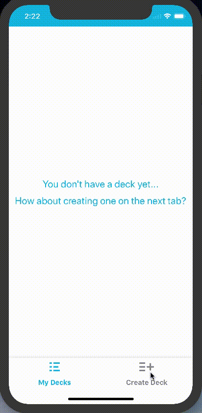

This project was bootstrapped with [Create React Native App](https://github.com/react-community/create-react-native-app).

## About the project
This is the third project for Udacity's React Nano Degree.
The application allows a user to create a deck of flash cards, each having cards with a question and answer for the deck's topic. The user can then start a quiz to test their knowledge of the chosen topic. Here's a quick preview of the app in action:

## App Stack
To develop this app, I used [Create React Native App](https://github.com/react-community/create-react-native-app) and Redux.
To store the user's information without a server, I used AsyncStorage and added a special button of doomsday to clear everything.

## App Structure
We have App.js as the main file located on the root of this repo and everything else (code speaking) is inside the `src` folder.

Inside of the `src` folder we have the code splited in:
* actions: Contains the redux actions creators
* api: Contains the fake server code, storing the data in AsyncStorage
* components: Contains all the dumb components for the app
* reducers: Contains the redux reducers
* store: Contains the redux store configuration
* util: Contains some helpers and constants such as colors
* views: Contains all the views that can be navigated to 

## Available Scripts

In the project directory, you can run:

### `npm install`

Installs the app's dependencies to run. 

### `npm start`

Starts the app with EXPO. 

The app will reload if you make edits. 

### `npm run android` or `npm run ios` or `npm run web`

Starts the app with EXPO for each of the OS. 

The app will reload if you make edits. 